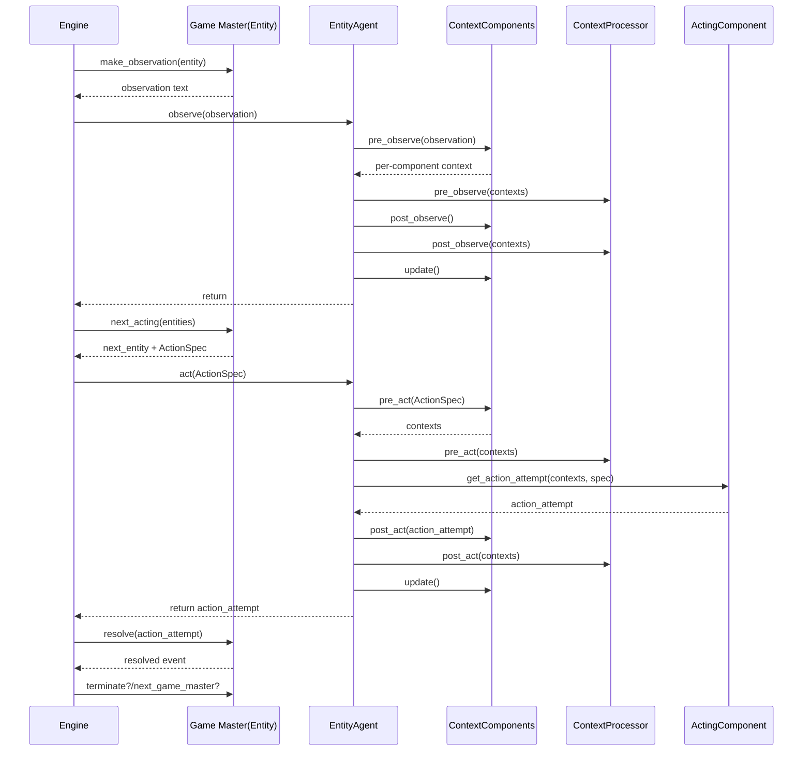
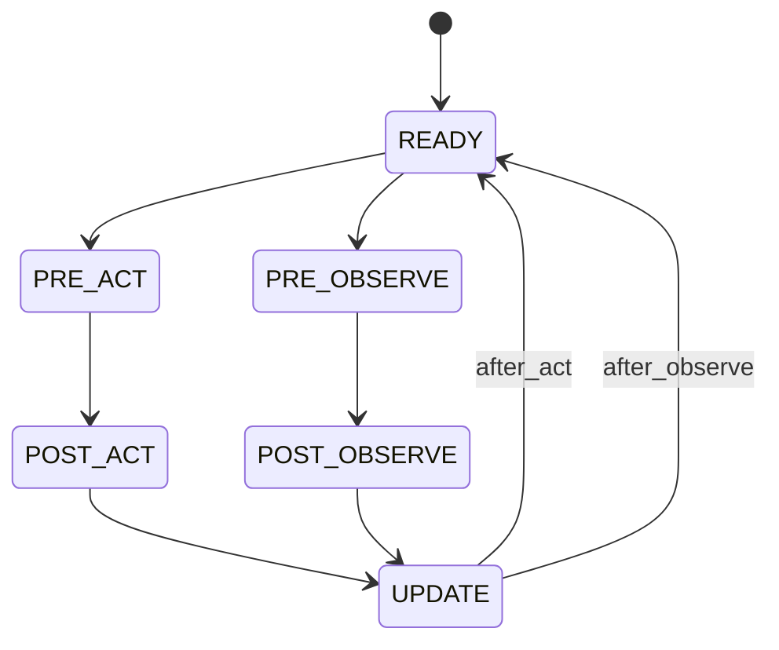
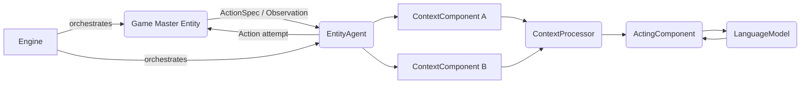

# Concordia Entity System 解构指南

> 面向已经熟悉架构/面向对象理念的工程师（例如 iOS 开发者），快速理解
> Concordia 如何把“多智能体 + 自然语言环境”拆分成若干接口/组合关系。
> 所有代码引用均位于仓库根目录 `concordia/`。

## 1. Entity：一切参与者的共同接口

- 源码：`typing/entity.py:192`
- 设计：最小化职责——只需提供 `name`，以及 `act(action_spec)` / `observe(observation)` 两个方法。  
  对应到 iOS 架构，可以理解为自定义 `UIViewController` 只需实现固定协议即可被导航控制器调度。
- 关键配套概念是 `ActionSpec`（`typing/entity.py:73`）：这是游戏主持人（Game Master, GM）与实体之间的
  “契约”，声明下一步调用期望的 `call_to_action`、`output_type`（FREE/CHOICE/FLOAT…）以及可选的
  `options/tag`。实体只需按合同返回字符串，如何引导它、如何检验由上层负责。

## 2. Component 体系：把复杂 Agent 拆成可插拔模块

- 源码：`typing/entity_component.py:150`
- `EntityWithComponents` 继承自 `Entity`，并持有多个 `ContextComponent`、一个 `ActingComponent`、
  （可选）`ContextProcessorComponent`。
- 生命周期钩子对应六个阶段：`PRE_ACT → POST_ACT → UPDATE` 与 `PRE_OBSERVE → POST_OBSERVE → UPDATE`，
  每个 Component 可以在这些钩子里收集、缓存或加工上下文——类似 iOS 中把 ViewController 拆成 DataSource、
  Delegate、Coordinator，各司其职。
- `ActingComponent.get_action_attempt(...)` 会收到所有组件拼接后的上下文，负责最终调用语言模型生成行动。
- 该体系天然支持组合：你可以像组装 `UIViewController + 子控制器` 一样，为实体拼装记忆、计划、观察等模块。

## 3. EntityAgent：组件编排器

- 源码：`agents/entity_agent.py:34`
- 角色：继承 `EntityWithComponents`，在 `act`/`observe` 时顺序调用所有组件的钩子，并用
  `_parallel_call_`（线程池 + 去重）聚合返回值，再交给 `ContextProcessor` 与 `ActingComponent`。
- 关键成员：
  - `_phase`：守护组件状态的状态机，防止乱序调用；
  - `_control_lock`：确保 act/observe 互斥；
  - `context_processor`：默认是 NoOp，但可以自定义，例如在 iOS 里拦截网络响应、做统一日志。
- 组合方式：构造函数里传入多个 `{name: ContextComponent}`，以及一个 `ActingComponent`。这些组件被注入
  `self` 引用，可以访问实体名称或共用的语言模型、记忆等资源。

## 4. Game Master：环境的“主持人”

- 虽然 GM 也是 `Entity`，但它被赋予了额外的 `OutputType`（`typing/entity.py:26`）：
  `MAKE_OBSERVATION / NEXT_ACTING / RESOLVE / TERMINATE / NEXT_GAME_MASTER` 等。
- Prefab 实现（例如 `prefabs/game_master/situated.py`）会利用这些 ActionSpec 来：
  1. 根据世界状态为每个实体生成观察；
  2. 选择下一位行动者并定制专属 `ActionSpec`；
  3. 解析实体的自然语言行动、更新世界并广播事件；
  4. 判断是否终止、是否切换到另一位 GM。
- 可以把 GM 理解为一个“SwiftUI EnvironmentObject”：所有实体通过它感知和影响共享世界。

## 5. Engine：回合/流程的控制器

- 抽象：`environment/engine.py:27` 定义了引擎接口，负责组织整个回合循环；
  对应 iOS 中 `UINavigationController`/`Combine Scheduler` 的角色。
- `Sequential` 引擎（`environment/engines/sequential.py:63`）是默认实现：
  1. 调用 GM 的 `MAKE_OBSERVATION`，并行推送给所有实体；
  2. 通过 `NEXT_ACTING` 选出下一个实体，随后再让 GM 生成该实体的专属 `ActionSpec`；
  3. 实体行动后，由 GM `RESOLVE` 并写入日志；
  4. 检查 `TERMINATE`，必要时 `NEXT_GAME_MASTER`。
- Engine 仅依赖 `Entity` 接口，因此可以轻松替换成并发/同时行动等模式，不影响 Agent/GM 实现。

## 6. LanguageModel：统一的推理后端

- 抽象：`language_model/language_model.py:37` 规定 `sample_text` 与 `sample_choice` 两个方法，
  参数包括 `prompt/max_tokens/temperature/top_p` 等——类似于把所有 LLM 提供商封装成一个
  `URLSession` 风格的协议。
- 具体实现（OpenAI、Gemini、Mock…）都实现同样接口，因此上层 Component/GM/Engine 可以无感切换后端。
- 结合插件：我们在 `plugins/token_budgeting.py` / `plugins/language_policy.py` 中又实现了包装器，
  通过组合（而非修改核心类）实现 token 控制与语言自适应。

## 7. 数据流回顾

1. Engine 驱动回合 → 调用 GM 输出观察 → 广播给所有实体。
2. 实体（通常是 EntityAgent）触发组件钩子，准备上下文 → `ActingComponent` 通过 `LanguageModel`
   生成自然语言行动。
3. 行动回到 GM，由 GM 解析（`RESOLVE`）并更新世界，再由 Engine 决定下一步。
4. `ActionSpec` 贯穿整个流程，确保调用契约；LanguageModel/Component 通过组合扩展能力；
   Engine 则掌控节奏与日志。

通过上述拆分，我们可以：

- 快速复用/替换组件（记忆、计划、语言策略等），如同在 iOS 中替换不同的 Coordinator 或 Service；
- 针对特定场景自定义 GM 或 Engine，而不必修改 Agent；
- 在插件层（`plugins/`）注入额外能力（token guard、语言检测、日志等），保持核心库的稳定。

## 8. 生命周期与时序图（Mermaid）

> 复制下方代码块到支持 Mermaid 的 Markdown 预览器（包括本仓库 `FLOW.md` 计划使用的渲染管线）即可查看。

### 8.1 Agent 行为时序

### 8.2 Phase 状态机

### 8.3 数据流概览

> 如果在本地/IDE 需要预览，可直接使用支持 Mermaid 的 Markdown 渲染器（包括 GitHub、Obsidian、VS Code 插件等）。
